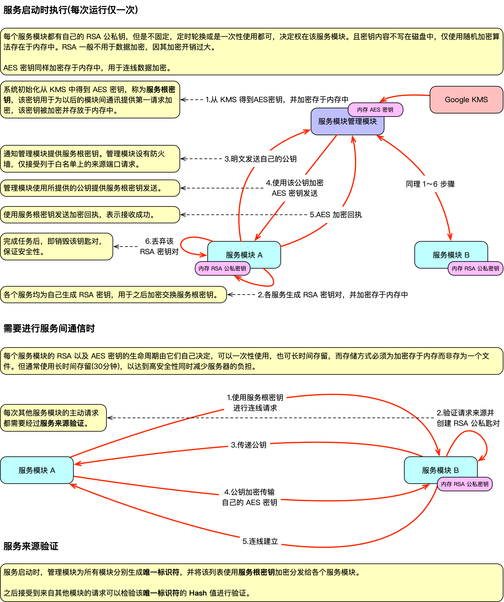
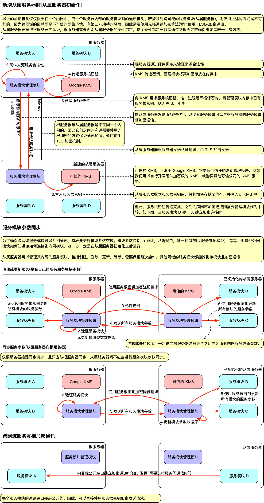
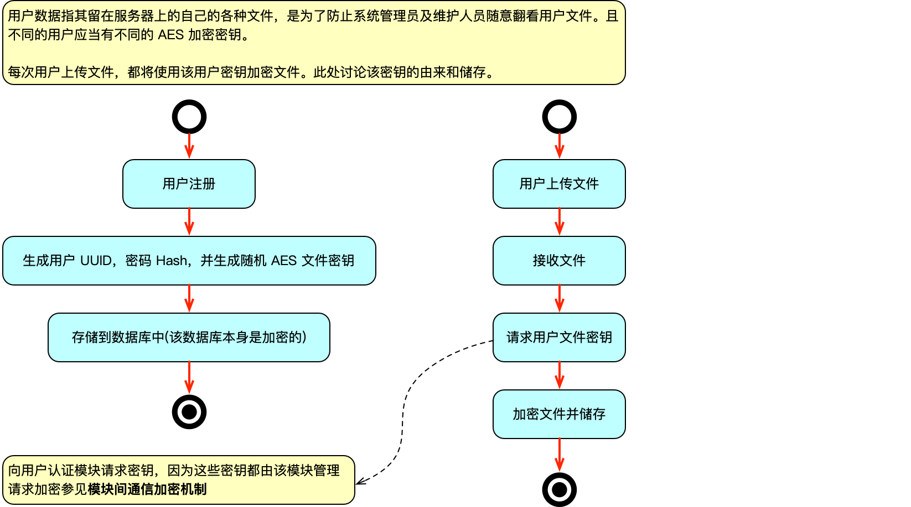

# Whooshing 服务模块管理器
由于整个 whooshing 网络系统是高度可扩展的，因此需要一个管理模块负责管理所有的其他服务模块。

该模块需要完成：

1. 密钥存储
2. 密钥轮换
3. 数据库、用户数据加密
4. 服务模块间通讯加密
5. 服务状态控制，例如启动，停止，状态监控等等
6. 管理日志


见[主项目](https://github.com/SJJC-Team/whooshing)

## **部署说明**

- **开发工具**：

  - **数据库**：PostgreSQL 17.2

  - **后端开发以及 API**：Vapor(Swift)
  - **密钥存储和管理**：[Vault](https://developer.hashicorp.com/vault)
  - **数据库加密**：[Perconna PostgreSQL pg_tde](https://github.com/percona/pg_tde)

初始化部署环境:

```shell
wget https://raw.githubusercontent.com/SJJC-Team/whooshing-module-manager/refs/heads/develop/env_init/init.sh
sudo chmod +x init.sh
sudo ./init.sh
```

## **设计图**

### 模块间通信加密机制



### 从属服务器加密通讯机制


### 用户数据加密机制




### 数据库加密

使用 PostgreSQL TDE 技术，用数据库 AES 密钥对其进行字段级加密，该密钥保存在 Google KMS 中以获得最佳安全性。


另见，[其他设计图](diagrams)


## **代码提交约定**

见 [代码提交约定](https://github.com/SJJC-Team/.github-private/blob/main/profile/README.md)


## **联系方式**

* 开发者邮箱：contact@official.whooshings.space

* 项目主页：https://whooshings.space
